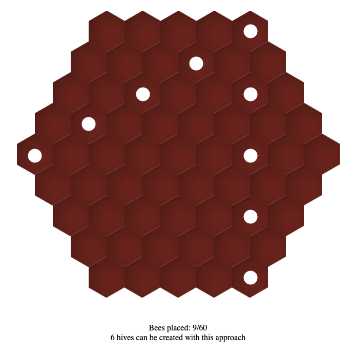

We got the last 60 bees ever and we need to save the species.

A queen would produce new bees but to get a queen we need to fill a hive.

* To fill one hex of the hive we can place a bee in it. 

* A hex would fill itself if there are 3 or more filled hexes around it

* If we add a bee to an entirely transformed hive it will become a queen.

We could place all bees into one hive but that would give us only one queen leading to slim chance of repopulation.
How do we increase the chance?
We should fill as many hives as possible getting most queens

Video

Let's solve the bee riddle with js

Here's the riddle itself: https://www.youtube.com/watch?v=rLL-y2WLE14

Solution

